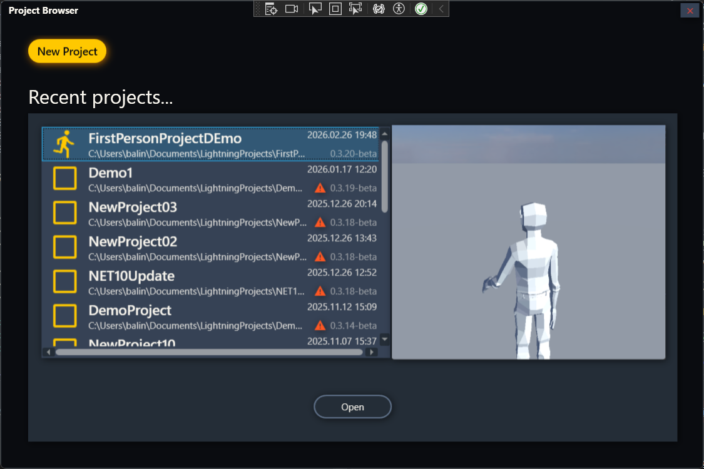
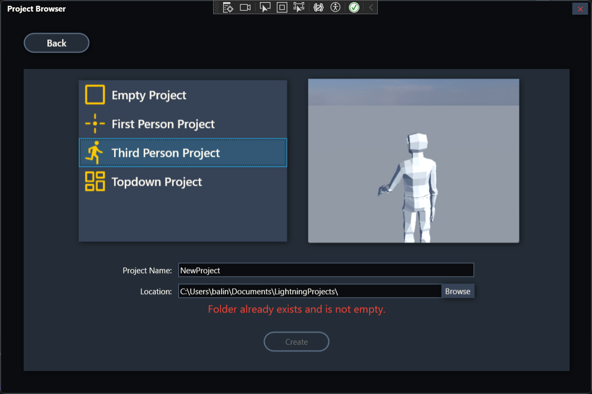
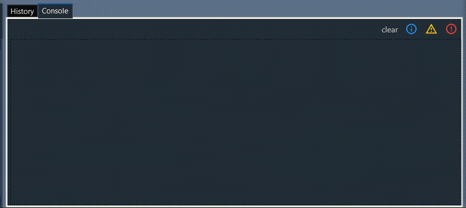
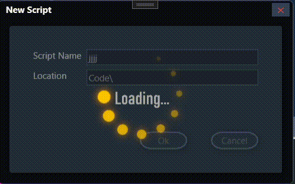
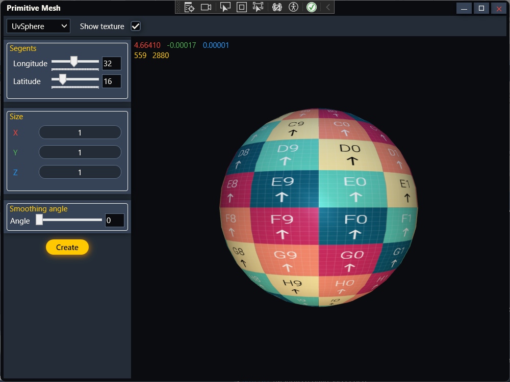
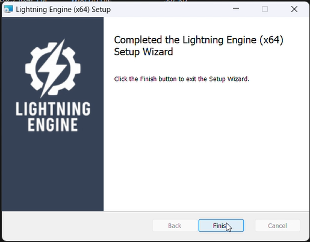

# Lightning Engine

A Windows-only learning project: a **C++ Game Engine** with a custom **WPF Editor**.

> Note: This is an AI-free place. No AI was used to write code here.

> Note: The C++ engine closely follows the [Game Engine Programming Series](https://www.youtube.com/@GameEngineSeries) tutorials with only minor changes.

> Note: This project uses VisualStudio 2026 which isn’t currently available on the default GitHub-hosted Windows runners. For this reason, the CI isn't working.

## Highlights

#### Project Browser
<p align="center">
  
  
</p>

#### The main Editor UI
<p align="center">
  
</p>

#### Building the project with MSBuild - Visual Studio output redirected to Edotor's UI
<p align="center">
  
</p>

#### Generic loading animation
<p align="center">
  
</p>

#### Importing assets (FBX files and textures only)
<p align="center">
  
</p>

#### Easy drag-and-drop Game Object creation
<p align="center">
  
</p>

#### Model inspector
<p align="center">
  
</p>

#### Installer
<p align="center">
  
</p>

## Installation
Download `Lightning Installer.msi` if you have *VisualStudio 2022* or *Visual Studio Build Tools* installed in your PC.\
Download `Lightning Setup.exe` if you want all dependencies installed for you.\
Download `lightning-engine-v?.?.?.zip` if you want to handle installation manually.\


## Languages
| language | files | lines |
| :--- | ---: | ---: |
| C# | 220 |  17,009 |
| C++ | 108 | 16,736 |
| XAML | 38 | 8,510 |
| XML | 27 | 2,103 |
| HLSL | 15 |  1,892 |
| Markdown | 5 | 457 |
| Python | 8 | 277 |
| YAML | 3 | 269 |
... +2 others (less than 100 lines)

```diff
+ If you made it this far, thank you for your time :)
```

## Lightning+
 - Linux (Experimental)

## Copyright

*This software contains Autodesk® FBX® code developed by Autodesk, Inc. Copyright 2008 Autodesk, Inc. All rights, reserved.*
